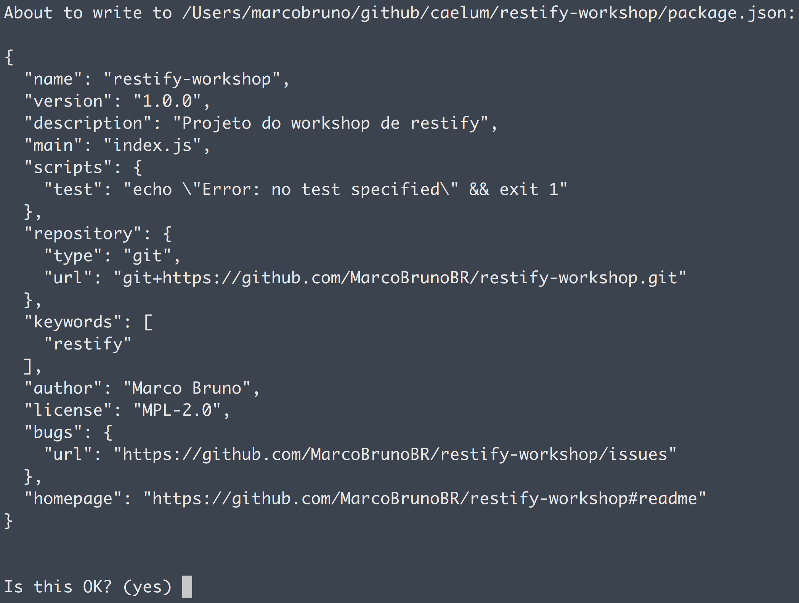

# O que você aprenderá no workshop

# Configurações necessário para começar o workshop

# Como começar um projeto qualquer em NodeJS

## Objetivo
Uma vez que você faz a instalação do NodeJS na sua máquina, você instalalou sem perceber um gerenciador de pacote chamado npm (Node Package Manager). Esse gerenciador é similar ao apt-get utilizado no Linux ou o homebrew do Mac, mal mas não sei qual seria o paralelo no Windows.

Vamos utilziar o npm para iniciar o nosos projeto com NodeJS definindo as seguintes propriedades do nosso projeto:
- Nome (package name);
- Versão (version);
- Descrição (description);
- Arquivo que o seu projeto inicia (entry point);
- Script de teste (test command);
- Repositório git (git repository);
- Palavras chaves pra localizar o seu projeto se ele for opensource é uma boa definir isso com cuidado (keyworkds);
- Autor (author);
- Licença, também utilizamos ela em caso de projetos opensource, particulamente gosto de duas licençar MPL-2.0 e Apache2 (license);

**Obs.** O texto que está entre parênteses e em inglês é a chave que o npm usa para guardar essas informações.

## Passo a passo com código

1. Crie uma pasta com o nome **restify-workshop** na pasta do seu usuário, gosto de fazer isso utilizando o terminal, se você estiver utilizando Linux ou Mac poderá executar os comandos a seguir em seu terminal (desculpa mas faz um bom tempo que não uso Windows e não sei como fazer isso nele):

### Terminal
Para navegar até a pasta do seu usuário:
```
cd ~
```

Para criar a pasta:
```
mkdir restify-workshop
```

Entrar na pasta **restify-workshop**:
```
cd restify-workshop
```

Rodar o comando para definirmos as propriedades do projeto (lembre-se que você tem que estar dentro da pasta **restify-workshop**):
```
npm init
```



Assim que você der o ENTER após o comando você irá começar a responder as peguntas sobre as propriedades do seu projeto, no momento que você terminar de responder essas perguntas, será apresentado um resumo onde você poderá verificar se está tudo certo, uma vez que você confirmar, nesse momento será criado pelo *npm* um arquivo chamado **package.json** e é nesse arquivo que é guardado todas as suas respostas. Vamos falar mais sobre esse arquivo durante os próximos exercícios.


# 


